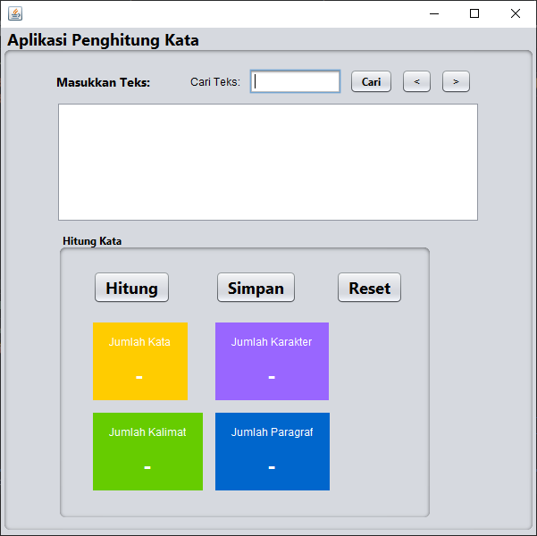

# Word Counter Application

Aplikasi **Word Counter** adalah aplikasi desktop berbasis Java yang dibuat menggunakan Java Swing di NetBeans. Aplikasi ini memungkinkan pengguna untuk menghitung jumlah kata, karakter, kalimat, dan paragraf dalam teks yang dimasukkan secara real-time. Selain itu, aplikasi ini dilengkapi dengan fitur pencarian kata dan kemampuan untuk menyimpan teks serta hasil perhitungan ke dalam file `.txt`.

## Fitur Utama

1. **Penghitungan Real-Time**:
   - Menghitung jumlah kata, karakter, kalimat, dan paragraf dalam teks yang dimasukkan.
   - Penghitungan dilakukan secara real-time, tetapi akan dihentikan sementara saat pengguna menekan tombol "Hitung" dan diaktifkan kembali setelahnya.

2. **Pencarian Kata**:
   - Memungkinkan pengguna untuk mencari kata tertentu dalam teks yang dimasukkan.
   - Setiap kemunculan kata yang dicari akan di-highlight pada JTextArea, dengan tombol **Next** dan **Previous** untuk navigasi di antara hasil pencarian.

3. **Simpan ke File**:
   - Aplikasi memungkinkan pengguna untuk menyimpan teks yang diinput dan hasil perhitungan ke dalam file `.txt`.

## Struktur GUI

- **JTextArea** `inputArea`: Area input untuk memasukkan teks. Hasil pencarian akan di-highlight di area ini.
- **JButton** `countButton`: Tombol untuk menghitung jumlah kata, karakter, kalimat, dan paragraf dalam teks.
- **JLabel** untuk hasil perhitungan:
  - `wordCountLabel`: Menampilkan jumlah kata.
  - `charCountLabel`: Menampilkan jumlah karakter.
  - `sentenceCountLabel`: Menampilkan jumlah kalimat.
  - `paragraphCountLabel`: Menampilkan jumlah paragraf.
- **JTextField** `searchField`: Area input untuk memasukkan kata yang ingin dicari.
- **JButton** `searchButton`: Tombol untuk memulai pencarian kata di dalam `inputArea`.
- **JButton** `nextButton` dan `previousButton`: Tombol untuk berpindah antara hasil pencarian yang di-highlight.
- **JButton** `saveButton`: Tombol untuk menyimpan teks dan hasil perhitungan ke dalam file `.txt`.

## Cara Menggunakan

1. **Menghitung Jumlah Kata, Karakter, Kalimat, dan Paragraf**:
   - Masukkan teks ke dalam `inputArea`.
   - Tekan tombol **Hitung** untuk memulai proses perhitungan. Jumlah kata, karakter, kalimat, dan paragraf akan ditampilkan di JLabel yang sesuai.

2. **Mencari Kata Tertentu**:
   - Masukkan kata yang ingin dicari di `searchField`.
   - Tekan tombol **Cari** untuk memulai pencarian. Setiap kemunculan kata yang dicari akan di-highlight di `inputArea`.
   - Gunakan tombol **Next** dan **Previous** untuk berpindah di antara hasil pencarian.

3. **Menyimpan Teks dan Hasil Perhitungan ke File**:
   - Tekan tombol **Simpan** untuk menyimpan teks yang ada di `inputArea` beserta hasil perhitungan jumlah kata, karakter, kalimat, dan paragraf ke dalam file `HasilPerhitungan.txt`.

## Tampilan Aplikasi

- ### Tampilan awal aplikasi saat baru dijalankan
  

- ### Memasukkan teks dan menjalankan proses hitung kata
  
  
- ### Melakukan pencarian kata
  
  
- ### Menyimpan inputan dan hasil hitung ke dalam file .txt
  

## Teknologi yang Digunakan

- **Java**: Bahasa pemrograman utama.
- **Java Swing**: Digunakan untuk membuat GUI aplikasi.
- **NetBeans IDE**: IDE yang digunakan untuk mengembangkan aplikasi ini.

## Cara Menjalankan

1. Clone atau download repositori ini ke komputer Anda.
2. Buka proyek ini di NetBeans.
3. Jalankan aplikasi melalui NetBeans.

## Lisensi

Proyek ini dilisensikan di bawah [MIT License](LICENSE).
